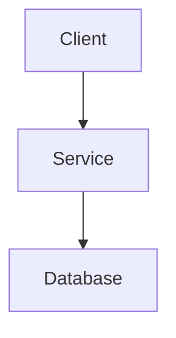

# Technical Design Specification

## Architecture Overview
[Components and data flow. ASCII or mermaid diagram where helpful.]



## Technology Stack
| Layer | Choice | Rationale |
|-------|--------|-----------|
| Frontend | [framework] | [why] |
| Backend | [runtime/framework] | [why] |
| Storage | [database] | [why] |
| Testing | [framework] | [why] |

## Data Model
[Schemas, relationships, migrations.]

```sql
CREATE TABLE example (
    id UUID PRIMARY KEY,
    created_at TIMESTAMP DEFAULT CURRENT_TIMESTAMP
);
```

## API / Interface Design
### [Method] [endpoint]
- Request: [shape]
- Response: [shape, status codes]
- Errors: [error format]

## Security Considerations
- [authentication / authorization]
- [secrets management]
- [data protection]

## Performance Considerations
- [expected load, caching, indexing]

## Deployment / Operations
- [environments, deployment strategy, observability]

## Technical Risks and Mitigations
| Risk | Impact | Probability | Mitigation |
|------|--------|-------------|------------|
| [risk] | [high/med/low] | [high/med/low] | [mitigation] |
